# Thematic maps in Geoda

[Lesson cheatsheet](https://glebpinigin.github.io/tiny_geoda_course/cheatsheets/Lesson 3.pdf)

Our today's lesson is about how to make simple thematic maps using GeoDa software. We will explore thematic mapping toolkit using Chicago Community Area dataset which has a large attribute table. It allows us to create a huge variety of thematic maps.

```{r fig.cap="Chicago Community Area dataset", echo = F}
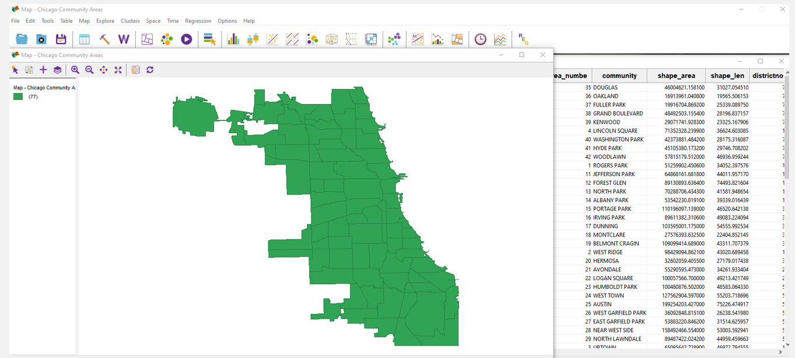
```

## What is a thematic map?

But first, what is a thematic map? Roughly speaking, a thematic map is a map about certain theme. It's interesting to see some kind of geographical pattern of a particular subject matter that's why we use such maps. The GeoDa allows us to create different kinds of a thematic maps. So, let's focus on some of them. During the lesson, we will use the interface which is shown on the left part of the slide.

```{r fig.cap="Thematic maooing toolkit", echo = F}
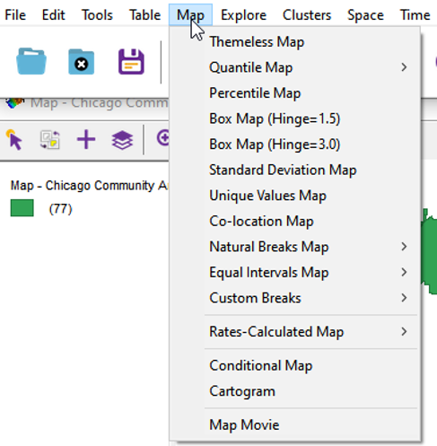
```

## Control panel

When the window opens, you will notice several icons at the top. That tools are used to select elements on the map, invert the selection, zoom in and zoom out. Also you can add the basemap. The tools details we will describe later.

```{r fig.cap="Control panel", echo = F}
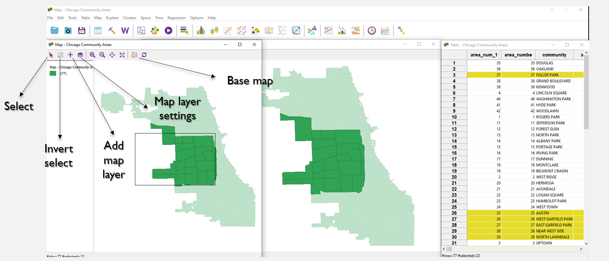
```

## Quantile map

Now, let's explore some mapping options. You can create a map using quantiles, dividing the entire data array into equal parts. You have the opportunity to choose the number of parts, ranging from two to ten.This kind of map is effective in accurately depicting the distribution of the indicator. By dividing it into equal intervals, we can easily identify the geographical patterns of the phenomenon's distribution throughout the territory.

```{r fig.cap="Quantile map", echo = F}
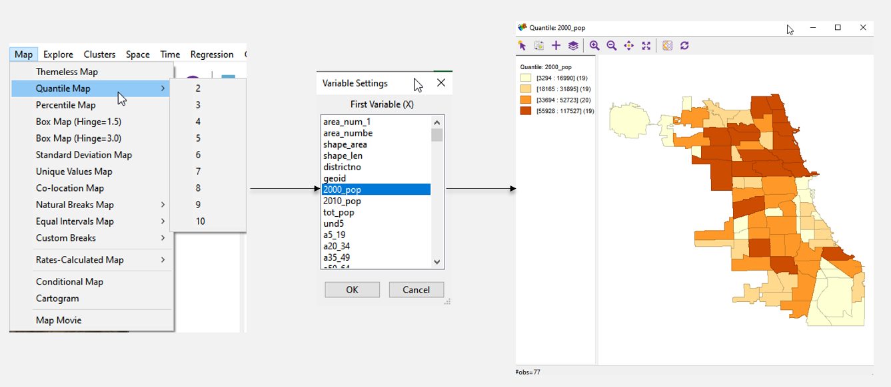
```

## Percentile map

Another possible choropleth is a percentile map, which enables the visualization of the percentage distribution of the variable by region.This map is suitable for displaying a non-uniform distribution.

```{r fig.cap="Percentile map", echo = F}
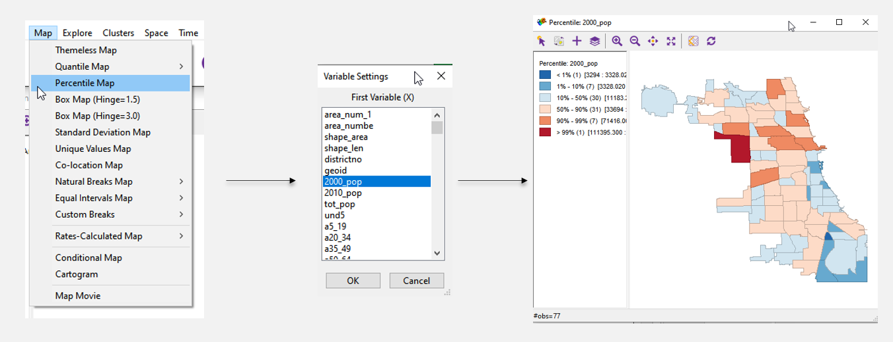
```

## Standard deviation map

Another interesting map is the standard deviation map which shows the deviation of the variable in each area from the average for all areas. If you wish to present the deviation of values in each cell from the mean, then this map option can be utilized.

```{r fig.cap="Standard deviation map", echo = F}
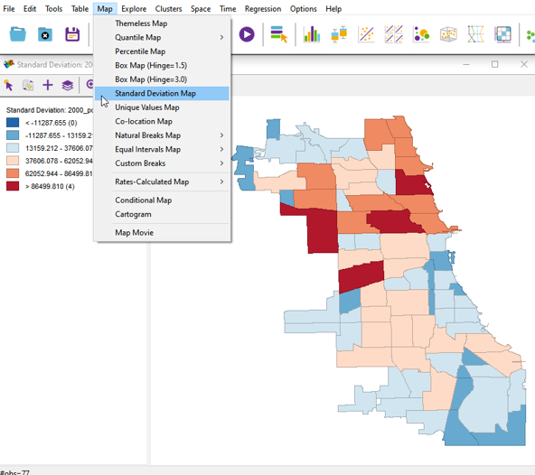
```

## Unique values map and choosing a color

Sometimes it's important to create the unique values map. With this kind of map you can focus on the color customization options in detail. In previous examples we used a gradient scale filling. But it's also necessary to customize color palette for optimal appearance. To do so, right-click on the color icon, select "Flip Color for Category" from the menu, and choose the color from the options.

```{r fig.cap="Unique values map and choosing a color", echo = F}
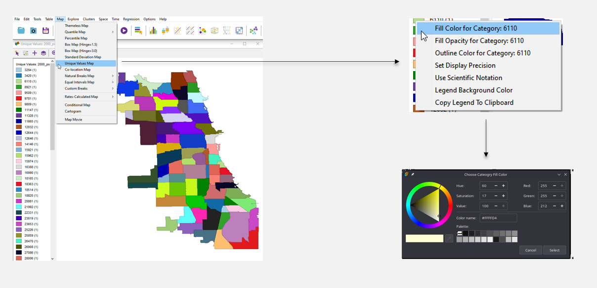
```

## Custom breaks with category editor

Another helpful feature in GeoDa is a scale division using different methods. The methods are natural intervals and equal intervals. Also you can create your own custom division method adjusting such parameters as the number of intervals, a value, and a method.This option is useful if you want to selectively highlight specific value groups and indicate them on the map. This can assist the data user in establishing logical connections.

```{r fig.cap="Custom breaks with category editor", echo = F}
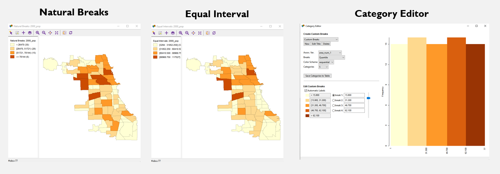
```

## Bubble map (cartogram)

You can create bubble map or cartogram with two variables. On picture on the right you can see that a circle size and a color visualize two different variables. All the previous maps have demonstrated the distribution of a single indicator. If you need to showcase the spatial relationship between two indicators, then this version of the map should be used.

```{r fig.cap="Bubble map (cartogram)", echo = F}
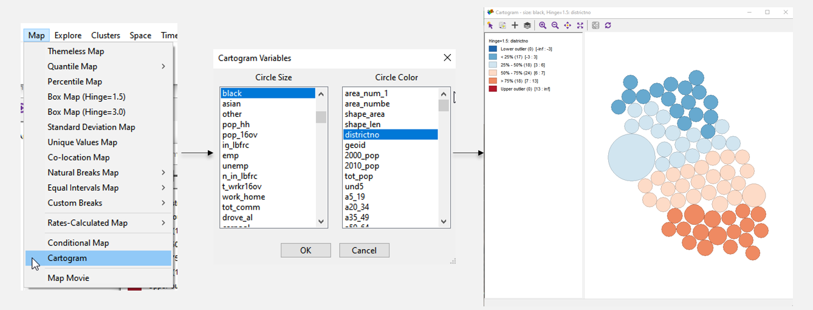
```

## Basemap

In conclusion, it is important to note a big variety of available basemaps in the software. You can choose not only default maps and satellite images but also specify a path to other map server location.

```{r fig.cap="Basemap", echo = F}
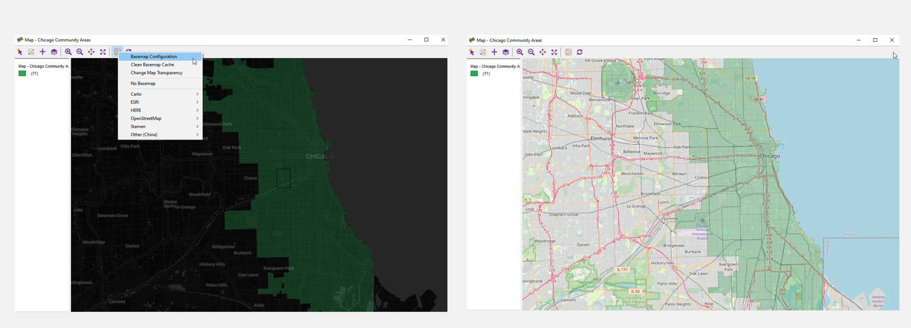
```

## Save and export

To save your map, right-click on an empty space in the map window and select "Save Image As." In the window that appears, you can adjust the map size and position of the legend.

```{r fig.cap="Save and export", echo = F}
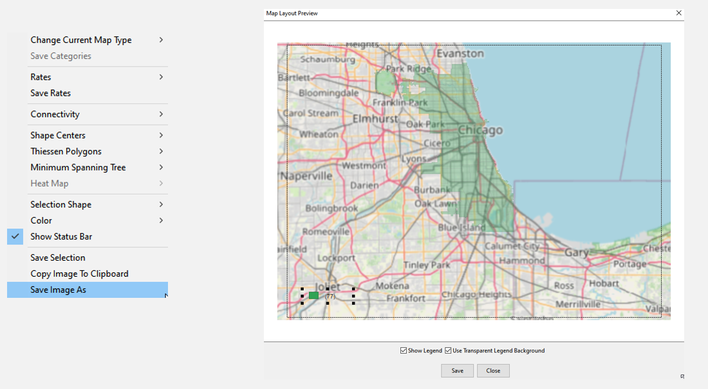
```

## Exercise

As an exercise, you should create three different maps using the specified dataset. The first map is a quantile map with 6 intervals, the second map is a percentile map and the third one is a standard deviation map. Write 5 sentences about differences between the first two maps. Change the colors and select a basemap for the standard deviation map. Save all three maps in .png format.

## Cheat Sheet

1. If you want to reflect 1 indicator:
	1. Use a quantile map if you want to display
	a measure divided into equal intervals;
	2. Use a percentile map if you want a different
	division of the indicator;
	3. If you wish to present the deviation of values in
	each cell from the mean, then this map option 
	can be utilized
	4. If you want to represent the deviation of values ​​
	in each map cell from the mean, use
	a standard deviation map
	5. You can use a unique values map if you want to
	mark areas where the indicator values ​​are the same;
	6. You can use other scale division options to
	manipulate data and visualize it on a map.
2. If you need to demonstrate spatial relationships
between two indicators, then a cartogram should be used. 
