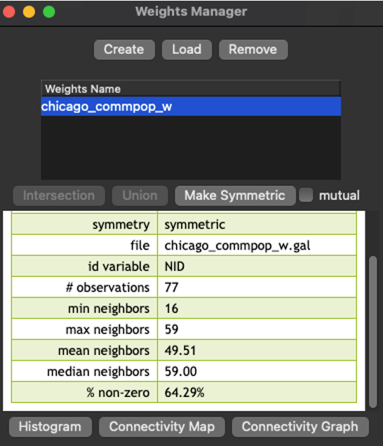
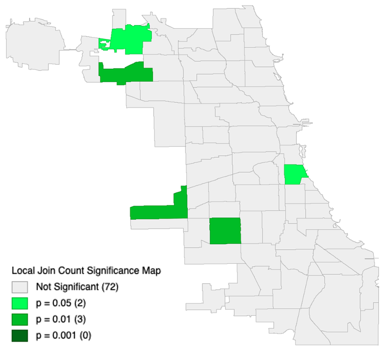
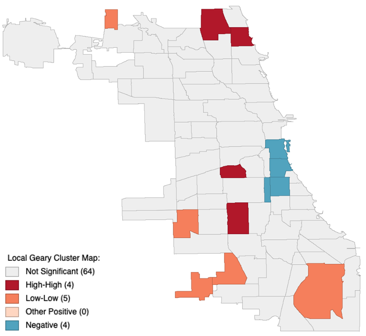
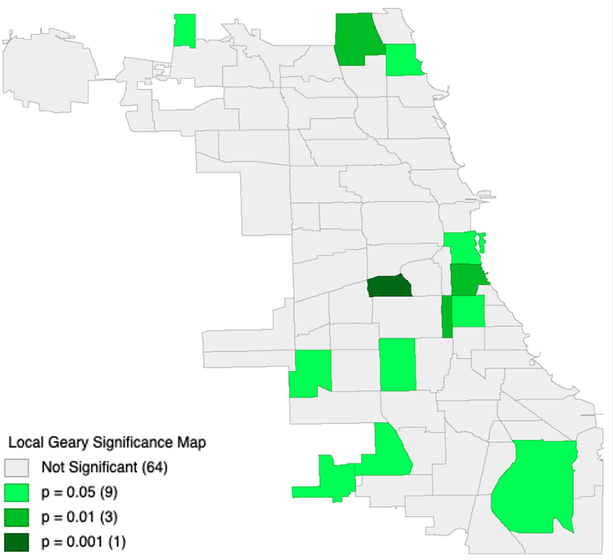
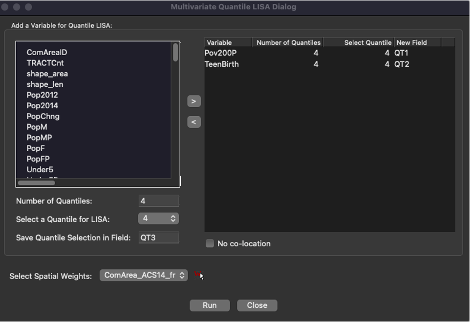
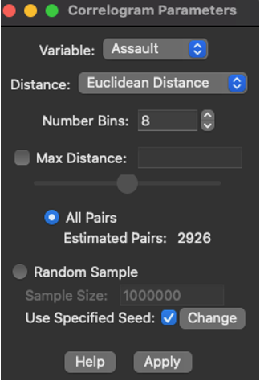
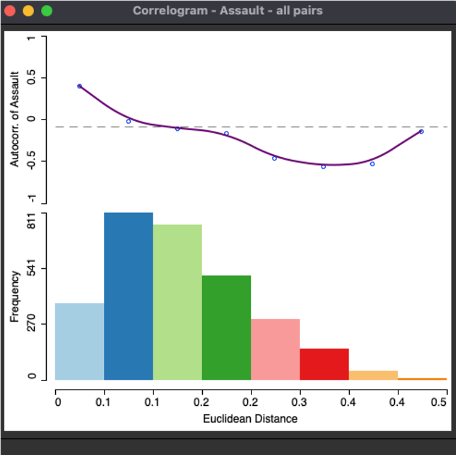
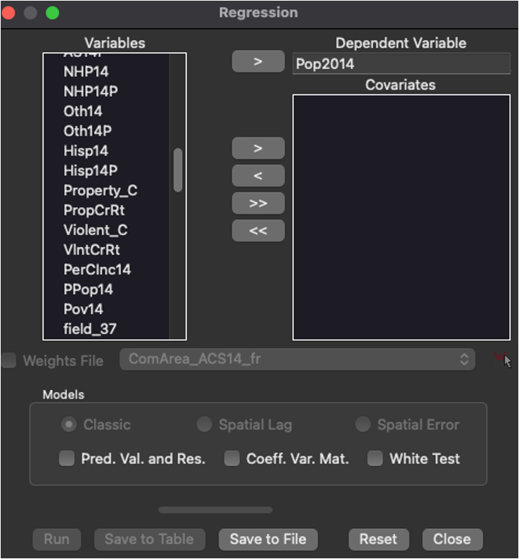
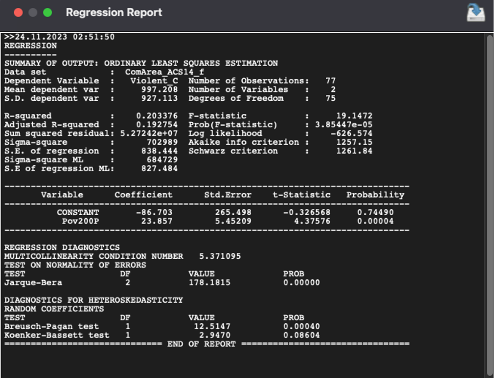

# Spatial statistics in GeoDa. Part 2

[Lesson cheatsheet](https://glebpinigin.github.io/tiny_geoda_course/cheatsheets/Lesson 6.pdf)

## Previous lection

In the previous lesson you have learned why spatial dependence is
important, also you have learned some basics including Moran's Index.
There are two types of Moran's statistics. First is global Moran's test.
This test allows us to assess the statistical relationship between the
value of the indicator in each location and in neighboring locations.
Second is local Moran's test. Using this method you can create maps
which can illustrate the spatial statistical differences between
variables. In general, Moran's Index is needed when you need to prove
the importance of connection between two variables. But also there are a
lot of different methods to explore the data.

## Theme of the lesson

In this lesson you will study the additional spatial statistics methods
represented in GeoDa:

-   Joint Count
-   Local Geary
-   Quantile LISA
-   Spatial Correlogram
-   Linear regression

## Contiguity and spatial weights

Contiguity and spatial weights are the two things which you can use in
the weight manager in the next cases.

In its simplest form, the *spatial weights* matrix expresses the
existence of a neighbor relation as a binary relationship, with weights
1 and 0. Usually this matrix is very sparse with a lot of zeros in it.

Contiguity means that two spatial units share a common border of
non-zero length. Operationally, we can further distinguish between a
rook and a queen criterion of contiguity, in analogy to the moves
allowed for the such-named pieces on a chess board.

## Joint count methods

### Theoretical basis

Joint Count method is a technique for processing discrete variables,
especially for binary variables. It is used to identify clusters in
binary variables by means of the local joint count statistics. The
statistics consists of counting the joins that correspond to occurrences
of value pair at neighboring locations. Mathematic representation of
this method: $$
BB_i = x_i\sum_{j}{w_i w_j}x_j
$$ This equation means that Joint Count is a sum of neighbors of $x_i$
which are have the same value that x. In conclusion, you can use these
methods to determine if there is a spatial connection between events or
they are distributed in the random way. \### Implementation in GeoDa To
create map using this method you have to create a weight matrix
first: 1. Open the Weights Manager 2. Choose "Create" 3. Select an ID
variable in your dataset 4. Choose type of contiguity 5. Choose variable
as spatial weight 6. Save the weight data In the end you will see
similar picture:

```{r fig.cap= "Weights Manager", echo = F}

```

After creating the weight matrix you can make the map. The only
available option is a significant map. 1. Open Local Joint Count in
Space bar menu 2. Select the variable you want to explore

```{r fig.cap= "Local Join Count Significance Map", echo = F}

```

This map represents a spatial significance of negative population growth
in Chicago city, IL. It means that the regions colored in green have
strong connection between their location and decreasing its population.
The reason can be different, but this reason stronngly affects to them.

## Local Geary

### Theoretical basis

Local Geary is a method to find the spatial autocorrelation through
dissimilarity of data. It means that small values of the statistics
suggest positive spatial autocorrelation, whereas large values suggest
negative spatial autocorrelation. It can be more precise that Local
Moran test in some cases because of differences in attribute similarity.

### Implementation in GeoDa

First, you need to prepare the weight matrix like in the previous step.
Next step is to open "Local Geary" in Space bar menu and select the
variable. In spite of Joint Count method you can choose two options for
the maps. First is a cluster map which is a representation of attribute
dependencies. Second variant is a significance map like in the Joint
Count method.

```{r fig.cap= "Local Geary Cluster Map. Tuberculosis in Chicago", echo = F}

```

The cluster map is a great way to show spatial dependencies connected
with attributes. Theoretically there are five categories. First category
is a "Not Significant". It means that there is no dependency between
attribute and spatial component. Second category is a "High-High". It
this category there is a strong positive connection between attribute
and location. The next category is a "Low-Low". This category represents
straight, but negative connection. It means that surrounding area has
the similar low values of the attribute like this regions. The fourth
category represents low significant straight connection. The last
category is about negative connection between this region and
surrounding area. But what it means in the practical way? Map shown in
the top represents the connection between location and tuberculosis
spreading, but let's imagine that it is a cost of the flat in
condominium. In the areas with "High-High" category there are high
prices both in the colored regions and surrounding area. In the
"Low-Low" areas cost is low in the similar way. Despite of this places
the areas with negative connection have a potential for a good deal. You
need to estimate is this place has a lower price that in surrounding
area or not. If it is you can save your money.

```{r fig.cap= "Local Geary Significance Map. Tuberculosis in Chicago", echo = F}

```

The Significance map represents power of the connection between
attributes and spatial location like in the Joint Count method.

## Quantile LISA

### Theoretical basis

Quantile LISA or quantile local spatial autocorrelation is a method to
find spatial autocorrelation between two or multiple continuous
variables. Linear association measured by Bivariate Local Moran suffers
from the location problem. Quantile LISA added a spatial component for
measuring correlations. More often it is used when the focus is on
extremes of the distribution.

### Implementation in GeoDa

First do the steps like in Joint Count and Local Geary methods with
creation of spatial weights. Next you need to select the variables and
quantiles for analysis.

```{r fig.cap= "Selecting quantiles and number of quantiles", echo = F}

```

Let's explore how extreme poverty is connected with teen pregnancy.
Select the category and use the last quantile. In this case we will see
the dependency between proportion of people with income less than 50% of
povery minimum and number of teen pregnancies.

```{r fig.cap= "Quantile LISA Significance Map. Connection between extreme povery and number of teenage pregnancies", echo = F}
knitr::include_graphics("images/lisa_signmap.png")
```

Like in the previous methods we can make a significance map representing
power of spatial correlation between attributes.

## Spatial correlogram

### Theoretical basis

A non-parametric spatial correlogram is an alternative measure of global
spatial autocorrelation that does not rely on the specification of a
spatial weights matrix. Instead, a local regression is fit to the
covariances, or correlations computed for all pairs of observations as a
function of the distance between them. The non-parametric correlogram is
computed by means of a local regression on the pairwise correlations
that fall within each distance bin. The number of bins determines the
distance range of each bin. This range is the maximum distance divided
by the number of bins. The more bins are chosen, the more fine-grained
the correlogram will be

### Implementation in GeoDa

First choose Spatial correlogram in space bar tools. Next choose the
data. You will see the "Correlogram Parameters" menu.

```{r fig.cap= "Selecting quantiles and number of quantiles", echo = F}

```

You should choose variable for analysis and number of beans first. Note
that there is an option that it will be no spatial dependency between
distance of the regions and attribute values.

```{r fig.cap= "Correlogram between number of assaults and distance", echo = F}

```

As you can see there is a little dependency between this two variables.
It means that number of assaults decreases with increasing distance
parameter between two regions. It can representate the fact that
unfortunate districts are close to each other and they are located in
the big distance from prosperous ones.

## Regression

### Theoretical basis

Regression analysis is a set of statistical processes for estimating the
relationship between a dependent variable and one or more independent
variables. In the standard regression parameters of the model are
constant. It means that there is no difference in spatial dependence
between variables. To solve this problem, you can use geographically
weighted regression. In this method weights are defined for every
location individually. In the mathematical point of view weight
coefficient matrix is used where close points have higher influence rate
than far ones.

### Implementation in GeoDa

-   Note that regression is in different menu than other spatial
    statistics tools
-   You need to select dependent and independent variables
-   You may add additional weights file

```{r fig.cap= "Settings of the regression", echo = F}

```

After processing you will see the Regression Report.

```{r fig.cap= "Regression Report", echo = F}

```

There are two key points in it. First: R-squared -- statistical measure
that determines the proportion of variance in the dependent variable
that can be explained by the independent variable. Second: F-value --
statistical measure where the null hypothesis is that all the regression
coefficients are equal to zero. In this case regression can't predict
the model of connection between data.

## Conclusion

-   Use Joint Count methods if you need to process with binary data
-   Use Local Geary methods if you need to describe the contiguous data
    and find similarity and dissimilarity areas
-   Use Quantile LISA if you need to process contiguous data with
    multiple variable and find an autocorrelation
-   Use spatial correlogram if you need to find correlation between
    differences of variable and different distances
-   Use a regression to prove your concept

## Task

-   Explore the spatial correlation between poverty with cancer deaths
    per 100 000 people in Chicago region.
-   Use this dataset:
    <https://geodacenter.github.io/data-and-lab/comarea_vars/>
-   Use Pov200P as an independent variable and CancerAll as dependent
    variable
-   Try Local Geary and Quantile LISA to find autocorrelation and make
    map. In the end use regression tool to make a conclusion between
    their dependency
-   Describe the result which you get with significance maps and
    regression report
