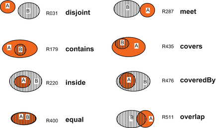
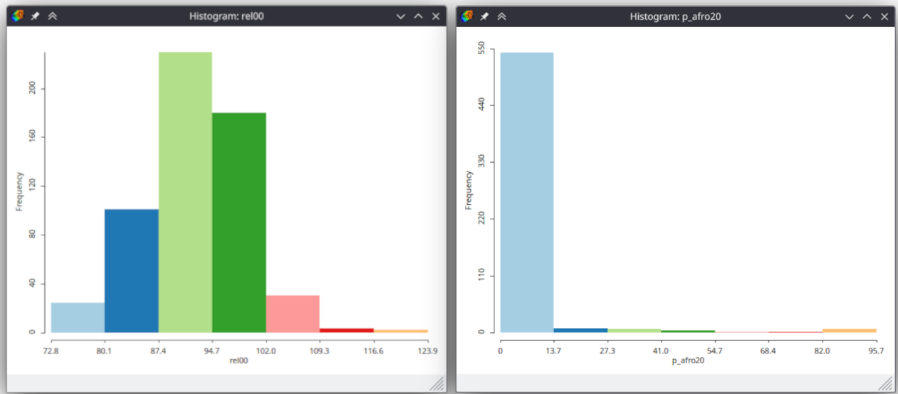
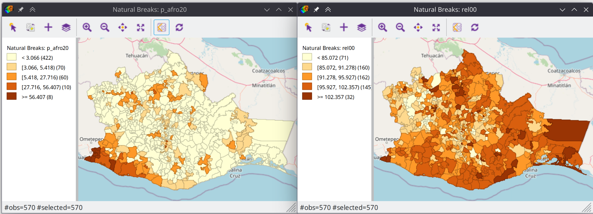
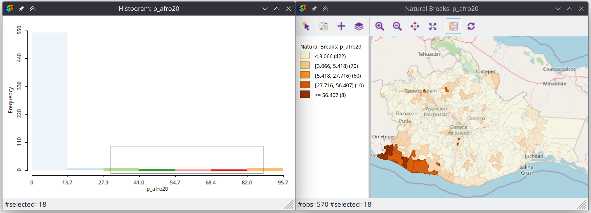
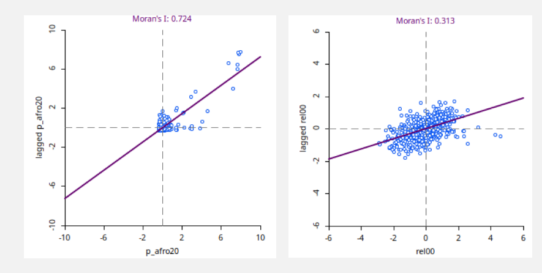

# The Inroduction

## The essence of maps

Creating map is a useful way to take space into account in your research.
The common ways to explain why to do so are Tobler's laws of geography:

> - Everything is related to everything else, but near things are more related than distant things
> - The phenomenon external to an area of interest affects what goes on inside
> --- <cite>Waldo Tobler</cite>\

In fact, you shall not interpret these as strict laws of any kind. However it
is very useful to treat these statements as initial hypotheses for spatial data
analysis. In order to check whether any spatial pattern is or is not presented
in a phenomenon, you can apply different techniques. Exploratory data analysis
can be performed with spatial data, displaying a map is a way to visually evaluate
quantitative features of spatial distribution, spatial statistics is a set of
techniques to estimate qualitative features of spatial distribution. And our
course follows this order to undercover you exciting world of spatial data analysis.

- First lesson is a brief introduction to a domain
- In the second lesson we will talk about creating plots with spatial data and GeoDa
- The third is about creation of simple thematic maps with GeoDa
- The last three lessons are about spatial statistics applications

Keeping in mind Tobler's laws it is useful to understand two essential components
of any map:

- Geographic space;
- Feature space.

Map depict things in _spatially ordered way_ and the order is inherited from the real
geographic space. This technique helps us to visually evaluate spatial relationship of objects, for example:

- How far objects are located from each other;
- How do the sizes of objects compare;
- What is the hierarchy of objects (e.g. one is located inside another);
- How are objects connected (e.g. they share some part of border).

(\#fig:unnamed-chunk-1)How objects can be related to each other in a map

The common approach to depict how the objects differ from each other is assignment
some graphical variables (e.g. color, size) to properties describing objects. 
Cartography uses this familiar basis for emphasizing the substantial features of
objects. Combination of graphical variable with geometrical shape gives us a
description of _where_ is the object and _what_ is the value of some opbject's property.

(\#fig:unnamed-chunk-2)Simple geometry types and graphic variables: building blocks of map symbols

## The necessity of maps

Now let's see how map creation with GeoDa can help us analyze distributions of
some census variables through Oaxaca state (Mexico) using [Oaxaca 
development dataset](https://geodacenter.github.io/data-and-lab/Oaxaca-Development/).
We will analyze the population of African descent and male/female population rate.
The distribution of race or ethnicity often follows some spatial patterns in regional
scale that demonstrate social and historical characteristics of an area. Evaluating of
such patterns is a clear illustration of spatial analysis applications. On the
contrary, human sex rate is more likely to appear roughly similar in scale of
single state.

Taking a look at histograms, we can notice the huge difference in the distribution of
variables. The distribution of human sex ratio is close to Gaussian distribution,
whereas the distribution of African descent is bimodal. We can see a major peak
with less than 13.7% population and a minor peak with more than 82%. There is
a huge temptation to conclude that most of municipalities are roughly the same
in terms of race distribution. However the minor peak in distribution suggests that we need to recheck our conclusions.

(\#fig:unnamed-chunk-3)Human sex rate (right image) and population of African descent (left image) in Oaxaca municipalities, Mexico

Creating thematic map is a side view that we need here. The combination of
municipalities' position and variable value in a single image instantly shows
us a compact region with high percentage of population of African descent.

(\#fig:unnamed-chunk-4)Population of African descent(left image) and human sex rate (right image) in Oaxaca municipalities, Mexico

The beauty of GeoDa is its capabilities for joint analysis of different types of
visualization. Now we can make sure that minor peak in histogram corresponds to 
located region by selecting histogram bins. GeoDa will automatically highlight
municipalities that share values with selected bins.

(\#fig:unnamed-chunk-5)Population of African descent in selected municipalities

In order to numerically evaluate the particularities of spatial distribution
we can apply spatial statistics techniques to our spatial data. By analyzing maps
we can visually distinguish types of distributions of different variables. We have
already noticed that municipalities with high proportion of population of African
descent form compact regions. This is an illustration of Tobler's law --
municipalities that share similar values are close to each other. However, the 
distribution of human sex rate doesn't appear to form such pattern. Human sex ratio
looks independent from spatial relationships of municipalities. Geostatistical way
to evaluate spatial dependencies is spatial autocorrelation analysis. We will discuss
this concept further in lessons 5 and 6. For now it is important to notice how
Moran's index and spatial correlogram --- the method of spatial autocorrelation 
estimation --- correspond to thematic maps. We can see significantly higher value
of Moran's index (0.7 vs 0.3) for percentage of population of African descent.

(\#fig:unnamed-chunk-6)Moran index of population of African descent (left image) and human sex rate (right image)

## Conclusion

In this lesson, we learned about the essence of spatial data analysis. We made a way from setting an initial hypothesis about the nature of the distribution of indicators to testing this hypothesis with the help of spatial analysis methods. This is the logic of our short course.

In the next two lessons, you will be introduced to exploratory data analysis techniques using plots creation and mapping in GeoDa. Then you will learn about clustering --- techniques to separate regions based on formal attributes. The last two lessons are devoted to geostatistics and spatial autocorrelation analysis.

Thus, our course will allow you to learn how to use GeoDa to look from the outside at your usual ways of analyzing data.
