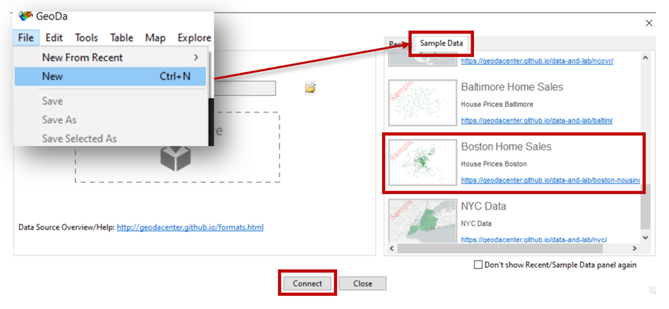
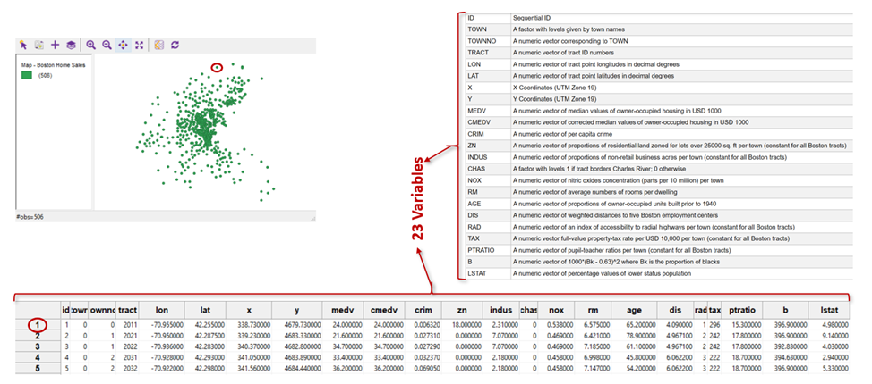
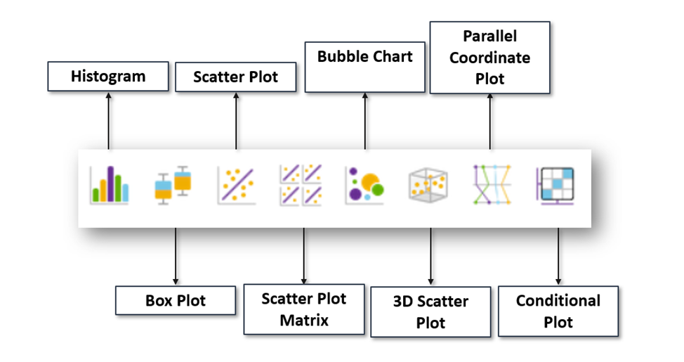
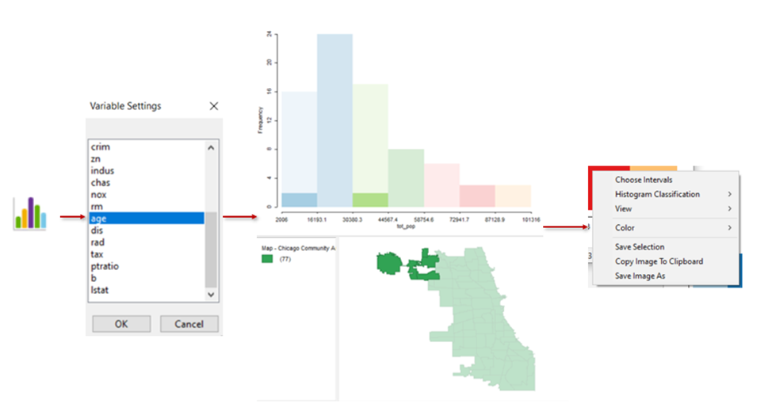
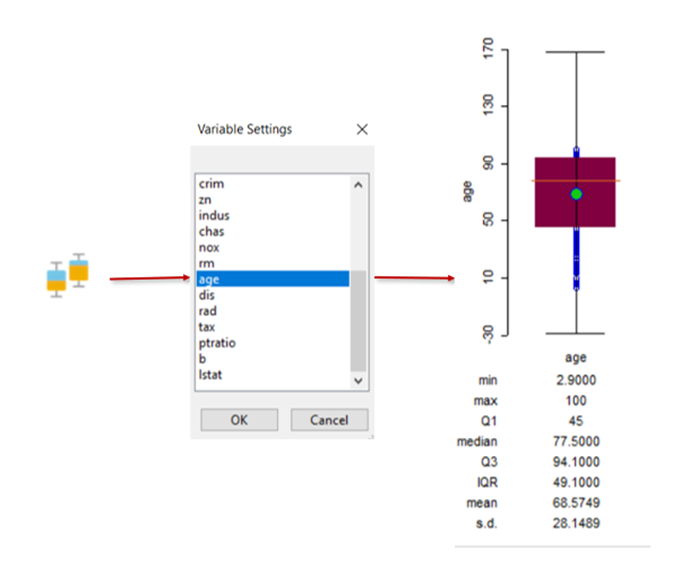
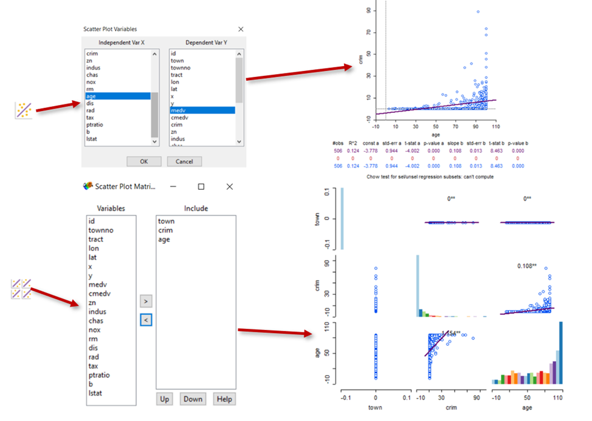
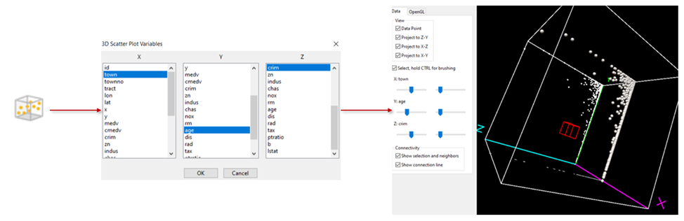
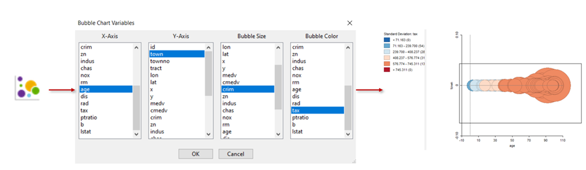
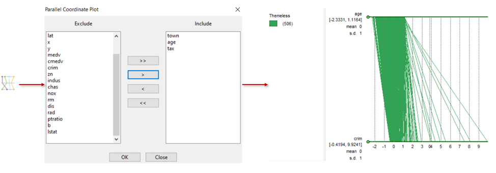
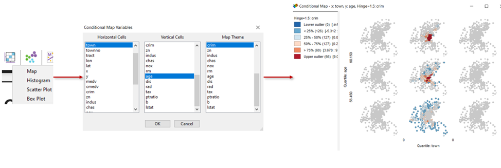

# Working with graphics in GeoDa

## Introduction
Today we are going to get acquaintanced with creating graphics for various statistic datasets in GeoDa. This GIS has prepared datasets and today we’ll use one of them. We’re going to work with **Boston Housing 1970s**, which contains housing and neighborhood data for the city of Boston based on research from the 1970s-90s. This dataset is a point shapefile with **506 observations** and **23 variables**. To open this data you have to choose _File>New_ and to choose _Boston Home Sales_ from _Sample Data_. After that you’ll be able to see the spatial distribution of the parameter. In the bottom left you’ll see the information about the number of observations.

(\#fig:unnamed-chunk-1)Opening the dataset

(\#fig:unnamed-chunk-2)Boston Housing 1970s

## Specific od data storage in GIS

To understand what observations and variables stand for we have to find out some facts about the ways of storing data in GIS. In GIS each object in a dataset consists of 2 parts: **geometric** (you see it) and **semantic** (responsible for the property of the object and represented as a row in a table). So, the semantic part is a table, where each _line_ is an _object_ of a dataset and each _column_ contains the _characteristic of the object_. It means that the number of _observations_ is a number of _objects (rows)_ and the number of _variables_ stands for the number of _object characteristics (columns)_.

(\#fig:unnamed-chunk-3)Storing data in GIS

## Graphic types in GeoDa

There’re 8 types of graphics in GeoDA: **Histogram, Box Plot, Scatter Plot, Scatter Plot, Matrix, Bubble Chart, 3D Scatter Plot, Conditional Plot**

(\#fig:unnamed-chunk-4)Types of graphics in GeoDa

### Histogram

**Histogram** shows the meanings of one variable for each chosen object. You have to push the histogram button on the control panel and to choose the variable you need. If you want to create histogram not for all objects, but for concrete ones, you have to choose them either from the table or from the map. In that case the histogram will show the meanings of the variable for all objects and for chosen ones. To open the table, you have to push the button on the control panel. To chose other colors for the histogram or to export it as an image, you have to click it with the right button and to choose the option you need. This works for all types of graphics in GeoDa.

(\#fig:unnamed-chunk-5)Creating Histogram in GeoDa

### Box plot

**Boxplots** are created to represent the distribution of a numeric variable. The graphic reflects maximum and minimum values, median, first and last quantiles and p-values at the same time. To create boxplot, you also just have to push the button on the control panel and to choose the variable you need. Boxplot also has some numeric characteristics for easier interpretation.

(\#fig:unnamed-chunk-6)Creating Box plot in GeoDa

### Scatter plot

**Scatter plot** is based on using Cartesian coordinates to display values for typically 2 variables for a dataset. There’re _3 types_ of Scatter plots in GeoDa. To create each of them, you still have to push a specified button on a control panel and create the variables. For classical scatter plot you’ll have to choose 2 of them. The **3D Scatter plot** uses the 3-dimensial representation for 3 variables. Finally, the **Scatter plot Matrix** is a grid of scatter plots used to visualize bivariate relationships between combinations of variables. Here you can choose more than 2 or 3 variables for comparison, if you need. To create scatter plots, you also just have to push the button on the control panel and to choose the variable you need.

(\#fig:unnamed-chunk-7)Creating Scatterplot and Scatterplot Matrix in GeoDa

(\#fig:unnamed-chunk-8)Creating 3D Scatterplot in GeoDa

### Bubble Chart

A **bubble chart** is a type of data visualization that uses circles (bubbles) to represent data points in a two-dimensional plot. It is similar to a scatter plot, but uses bubbles instead of dots. Typically, a bubble chart shows the values of three numeric variables, with each circle representing an observation and its position on the plot indicating the values of two other variables. To create bubble chart, you also have to push the button on the control panel and to choose the variable you need. 

(\#fig:unnamed-chunk-9)Creating Bubble Chart in GeoDa

### Parallel coordinates plot

**Parallel coordinates plot** is a common way of visualizing and analyzing high-dimensional datasets. A point in n-dimensional space is represented as a polyline with vertices on the parallel axes and the position of the vertex corresponds to the coordinate of the point. To create it, you have to push the button on the control panel and to choose the variable you need.

(\#fig:unnamed-chunk-10)Creating Parallel coordinates plot in GeoDa

### Conditional plot
*
**Conditional plot** consists of two variables conditional on the value of a third variable. You can create _a map, a histogram, a scatter plot or a boxplot_, using the button on a control panel. You’ll have to choose 3 variables and get 9 graphics, showing their dependencies.

(\#fig:unnamed-chunk-11)Creating a Conditional plot in GeoDa

## Practical exercise

To check yourself after this lesson you have to built 3 Graphics for the observations with the towno=27.
  1. You have to create a histogram to analyze distances to Boston employment centers (dis);
  2.  You have to create a histogram to analyze per capita crime (crim) and fix in *.txt file the minimum, maximum, mean and median        values of the variable;
  3. You have to create a bubble chart to analyze the dependencies between such variables as age (x-axes), dis (y-axes), crim (bubble-size) and indus (bubble-color).
The result of your task must be represented by a txt-file with statistical parameters and 3 png-files with graphics.
