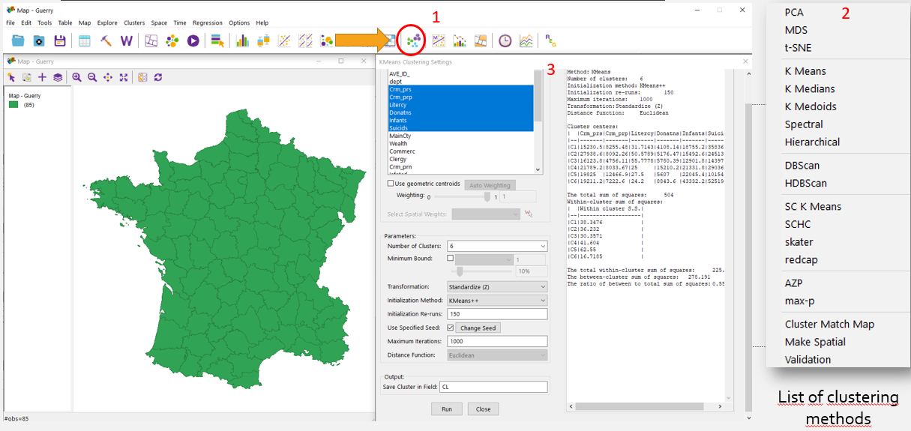
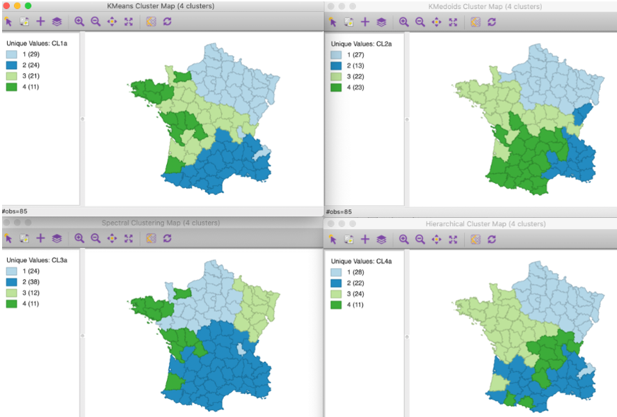

# Clustering algorithms in real life problems

## Clustering goals:

-   Simplifying data processing

-   Data compression

-   Identification of anomalies (atypical objects)

-   Building a hierarchy of objects

## Where was it used?

(\#fig:unnamed-chunk-1)Pickpoints in taxi

(\#fig:unnamed-chunk-2)Multy-scale clustering in gallery

## Clustering issues:

-   Fuzzy problem statement

-   Variety of quality criteria

-   Prevalence of heuristic approaches

-   Unknown number of clusters

-   Dependence of the result on the selected metric

## Most popular Clustering algorithms:

1.  Statistical clustering

-   K-mean
-   ISODATA
-   FOREL (formal elements)

2.  Hierarchical/graph clustering
3.  Density Clustering (DBSCAN/OPTICS)

## K-means method

1.  Set the number of clusters K
2.  Select randomly K points as cluster centers
3.  Determine the nearest cluster center for each point
4.  Calculate a new cluster center based on the coordinates of its points
5.  Repeat steps 3-4 until the cluster centers stop changing their location.

(\#fig:unnamed-chunk-3)Example with four clusters:

(\#fig:unnamed-chunk-4)All points of the resulting clusters are located inside the cells of the Voronoi diagram for the centers of these clusters:

(\#fig:unnamed-chunk-5)The algorithm is good at identifying only spatially separated clusters of convex shape.:

## ISODATA

Iterative Self-Organizing Data Analysis Technique Algorithm

The method starts with one cluster and performs a recursive division of the set along its longest axis until all intra-cluster distances are within a given tolerance.
The working algorithm is presented below:

(\#fig:unnamed-chunk-6)ISODATA method

ISODATA method compared to K-means:

1.  It is not necessary to specify the number of clusters.
2.  A more robust method for calculating the resulting clusters.
3.  Also not effective in identifying irregularly shaped clusters.

## Hierarchical clustering

-   It is recommended to use Ward's distance (red line at the picture)
-   It makes sense to build several options and choose the best one
-   The clustering level is obtained by pruning the tree at a given distance.

(\#fig:unnamed-chunk-7)Hierarchical method

## DBSCAN

Advantages: 1.
The number of clusters is not required.
2.
Can find clusters of stable forms.
It may even find a cluster that is completely surrounded by, but not connected to, another cluster.
3.
Creates noise and is resistant to emissions.
4.
Only two parameters required

DISAdvantages: 1.
Not completely deterministic: edge points accessible from more than one cluster may be part of any cluster, depending on the order in which the data is processed.
2.
Cannot group data sets well where the clusters have different densities.

(\#fig:unnamed-chunk-8)DBSCAN method

(\#fig:unnamed-chunk-9)DBSCAN method

The described clustering methods are far from the only ones, but they are among the most popular.
The described clustering methods are far from the only ones, but they are among the most popular.
Next, we will look at how these methods are implemented in GEODA.

## GEODA interface

When opening the clustering tools in GeoDA, you can select the clustering method, and then the number of clusters, selection distances, the minimum number of points in the class, etc.

(\#fig:unnamed-chunk-10)1 - button with clustering tools, 2 - clustering methods? 3 - window with option of clustering

## What Data should I use for clustering?

Clustering can occur on the basis of attribute data, spatial data and their joint significance.
At the same time, we can combine attributive and spatial data both in equal importance and giving greater weight to one of the data categories.

(\#fig:unnamed-chunk-11)Variants of how clusters look, depending on the choice of data on which clustering is based.

*ATTENTION! Use projected coordinates. NOT geographic coordinates.This is necessary for correct calculation of distances. For example, UTM zone 31 N*

We suggest looking at the results of different clustering methods on test data.
Test Data Attributes (France, 18th century): 
1. Used indicators for example:
2. Population per Crime against persons
3. Population per Crime against property. 
4. Percent of military scripts who can read and write. 
5. Donations to the poor. 
6. Population per illegitimate birth. 
7. Population per suicide.

(\#fig:unnamed-chunk-12)1. K-Means, 2. K-Medoids, 3. Spectral, 4. Hierarchical

**HOMETASK: Build a network of electric charging stations for cars in a small town**

Electric charging infrastructure is rapidly developing around the world. Imagine that in the small city of your choice there is not a single fast charger for cars. The cost of their construction is high, which means it is necessary to optimally place a small number of fast charging stations. According to the plan, one charging station will be installed per 10,000 people in the city.
Exercise:
1. Select a small city (50,000 to 100,000 people).
2. For each house, add a field with the number of apartments or number of residents.
3. Get centroids of residential buildings
4. Group a given set of points. The number of clusters must correspond to the population of the selected city (1 charging station = 1 cluster = 10,000 people).
5. Select the optimal location of charging stations, based on the fact that they should be close to the geometric center of the resulting clusters.
6. Justify the choice of clustering method for this task based on the lecture materials. Draw up a map(s) to justify the optimal location of charging stations, describe the characteristics of the resulting clusters.
Send maps and justification for the chosen clustering method to: vitaliy_mapgeo@mail.ru
