# Spatial statistics in GeoDa. Part 1

## What is spatial statistics?

**Spatial statistics** is a branch of mathematical statistics that deals with the numerical description of variables distributed in geographic space.
Most often, tools of spatial statistics are used to solve the problem of interpolation.
In other words, we reconstruct a continuous field of distribution of a random variable from a limited set of data at observation points.
However, spatial statistics as a scientific discipline is much wider, with its primary task being the statistical *description of spatial distributions*.

## Why spatial statistics is important?

Spatial statistics is based on a widely developed mathematical apparatus, and understanding the basics of it is a necessary condition for the deliberate use of geostatistical methods in practice.
The world of spatial statistics is based on the fundamental concepts of *random variables*, *random functions*, and *random processes*.
Measuring uncertainty is critical to decision making because it provides information about possible outcomes for all locations, not just one predicted value.
The GeoDa software has a wide range of spatiostatistical tools, primarily focused on finding spatial correlations in existing data.
So, it is essential to explore how to use GeoDa to solve spatial tasks.

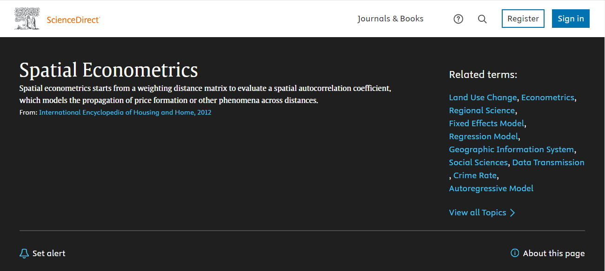

(\#fig:unnamed-chunk-1)Spatial Econometrics topic in [Science Direct portal](https://www.sciencedirect.com/topics/social-sciences/spatial-econometrics)

## Theory

The starting point of geostatistical analysis is a set of points $\{p_1,p_2,...,p_n\}$ called **locations**, each of which includes the value $\{Z(p_1),Z(p_2),...,Z(p_n)\}$ of some spatial variable.
The spatial and attribute components are traditionally divided into two, and both can be random.
Values in locations are obtained by measuring a spatially distributed variable.
The measurement results, like the data used for calculations, usually characterize the state of the environment at a certain moment.
To work with such data, the concept of a random variable is used.
Therefore, a *random variable* is a function that, as a result of a random event, takes on a real value, and a random process is a family of random variables indexed by some parameter.

> **Random variable** $Z(w)$ is a function, that, as a result of a random event $w$, takes on a real value
>
> **Random process** is a family of *random variables* indexed by some parameter $t$

## Pre-prepared data

Now, let's explore the existing pre-prepared data available in the software.
For example, we can examine the **Boston Housing 1970s** dataset, which includes housing and neighborhood data for the city of Boston based on research from the 1970s---90s.

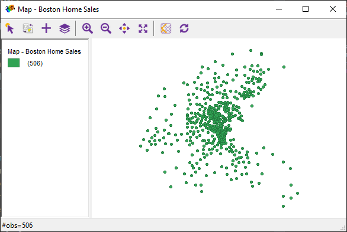

(\#fig:unnamed-chunk-2)Overview of Boston Housing 1970s dataset

It contains 506 observations with 23 variables, each point representing a house for sale.

Let's take two variables from the dataset that will help us solve a specific problem.
Imagine you are working in the Boston housing market.
It is necessary to find out in which part of the city it is profitable to sell housing with a large number of rooms.
So the numeric vectors of median values of owner-occupied housing in \$USD (*medv*) and the average numbers of rooms per dwelling (*rm*), can help us determine whether the value of a variable depends on the surroundings of points in space.

## Moran's I tests

One of the easiest ways to study whether there is a relationship between values in each location and in neighboring locations is the **Moran's Index test**.
Moran's I statistic is arguably the most commonly used indicator of global spatial autocorrelation, expressed as a cross-product statistic between a variable and its spatial lag, with the variable expressed in deviations from its mean.
Moran's I statistic is then given by the formula:

$I = \frac{\sum_{i} \sum_{j} w_ij z_i \cdot z_j/S_0}{\sum_{i}z_i^2/n}$

with $w$ as the elements of the spatial weights matrix, $S_0$ as the sum of all the weights, and n as the number of observations.

## Weights matrix creation

First of all, we need to calculate the spatial weights matrix.
To do this, **click on the "W" icon** located on the instrument panel.

(\#fig:unnamed-chunk-3)Weight Manager icon

In the pop-up window, we begin to create a matrix of weights by **clicking the "create" button**.

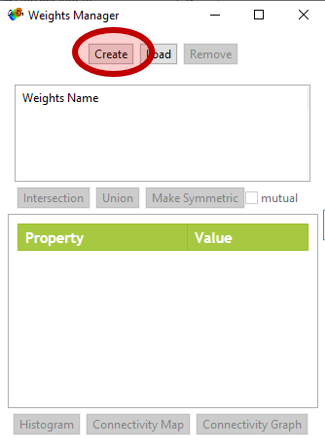

(\#fig:unnamed-chunk-4)Weight Manager icon

The study of spatial autocorrelation begins with an analysis of *geographic proximity*.
That is, for each analyzed unit, we must determine the adjacent units.
This is not so simple because there are many ways to define a neighborhood.
GeoDa can calculate spatial weights **by contiguity** and **by distance**.
Contiguity-based adjacency is used when analyzing data associated with area units, such as an administrative division grid.
So, this is not our case, and we will calculate [distance weights]{.underline}.
**Select the ID variable** at the top of the window, then **select the X- and Y-coordinate variables** from the list below.
Leave the rest of the fields with default settings.
**Click "create"** and **save the spatial weight file in your home directory**.

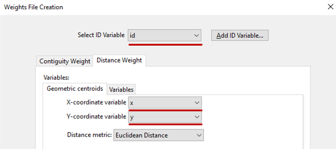

(\#fig:unnamed-chunk-5)Weight Manager icon

## Visualizing adjacency

After that, in the "Weights Manager" pop-up window, you can see that **the characteristics of the weights file appear**.

(\#fig:unnamed-chunk-6)Spatial weights table in _Weights Manager_

In that window, you can also explore a neighbors' histogram, connectivity map, and connectivity graph.

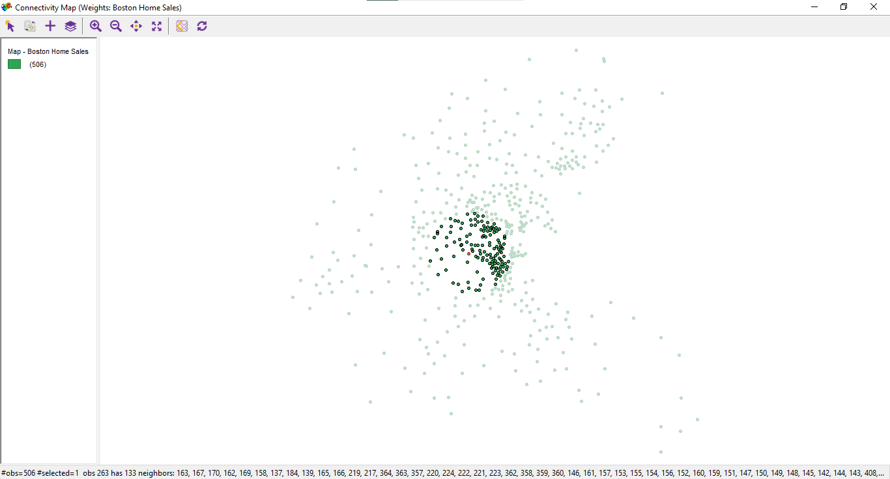

(\#fig:unnamed-chunk-7-1)Connectivity map

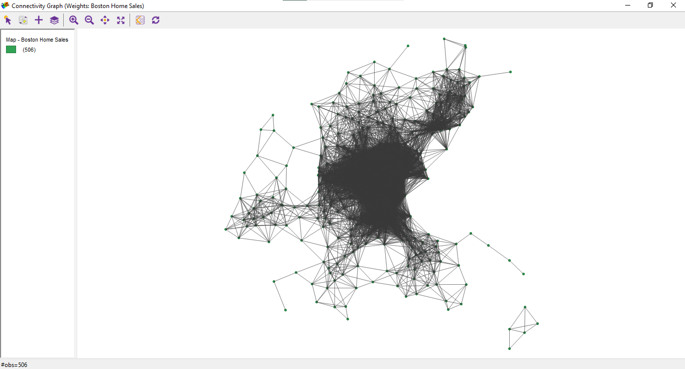

(\#fig:unnamed-chunk-7-2)Connectivity graph

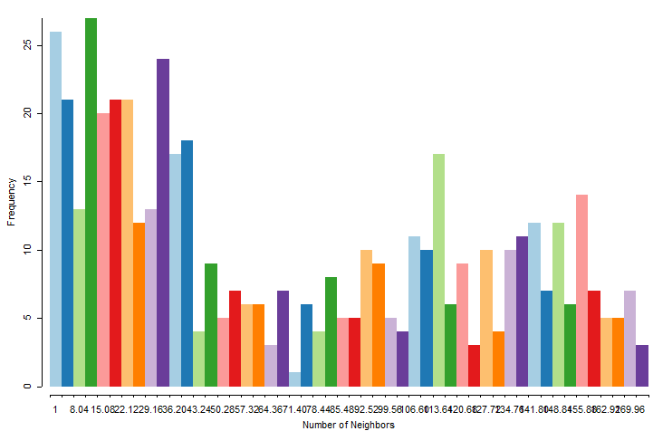

(\#fig:unnamed-chunk-7-3)Neighbours' histogram

It's interesting to see how the spatial algorithm works, and it's also helpful to choose the correct type of adjacency to create appropriate spatial weights.

## Global Moran's I test

Now that a weights matrix has been created, we will use the **Moran's I tests** to estimate the best district for selling houses.
This test allows us to assess the statistical relationship between the value of the indicator in each location and in neighboring locations.
Based on Moran's test result, we can estimate spatial regression for different types of forecasts.
There are two basic types of Moran's tests.

*The global Moran's test* evaluates the presence of statistical dependence for the entire set of points, while the local test evaluates each point separately.
First of all, let's calculate the univariate Moran's test.
**Click on the Space tab**, **choose the Univariate Moran's I test**, **select the "*medv*" variable**, and **click OK**.

(\#fig:unnamed-chunk-8)Univariate Moran's I menu

The Moran's test scatter plot appears.

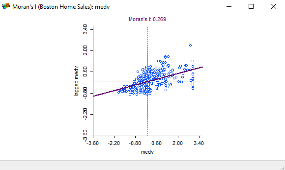

(\#fig:unnamed-chunk-9)Univariate Moran's I scatter plot

Moran's index ranges from -1 to 1.
Our result is 0.269, which means that there is a weak statistical relationship between the cost of housing at each point and the neighboring points.
We can also **estimate a bivariate Moran's test** in same way.
Instead of using the univariate Moran's test, **click on the bivariate Moran's test** and **select the *medv* and *rm* variables**.

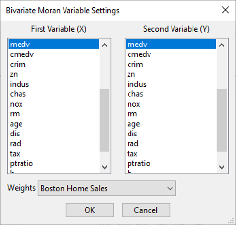

(\#fig:unnamed-chunk-10-1)Bivariate Moran's menu

(\#fig:unnamed-chunk-10-2)Bivariate Moran's I scatter plot

The spatial correlation between housing medium values and number of rooms is exist.
Now let's explore in which areas of Boston will the relationship between variables be the greatest.

## Local Moran's I test

For that purpose we can calculate **the Local Moran's I test**.
This test is much more interesting than the global test because we can create maps.
Let's try to calculate the univariate Local Moran's test.
**Select the *medv* variable** once again and **click OK**.

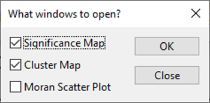

(\#fig:unnamed-chunk-11)Local Moran's I map menu

In the pop-up window, you can choose three types of graphics.

The first two are the cluster and significance maps that illustrate the spatial statistical differences.
**Mark both maps and click OK**.

The cluster map shows how strongly the cost of housing in neighboring locations is related to the cost of housing in each location, and the significance map shows how significant a statistical relationship is.
The smaller the p-value, the greater the significance.

Similarly, you can perform a local Moran's test for two variables.
Just choose the *medv* and *rm* values in the pop-up window, and you will see a result.

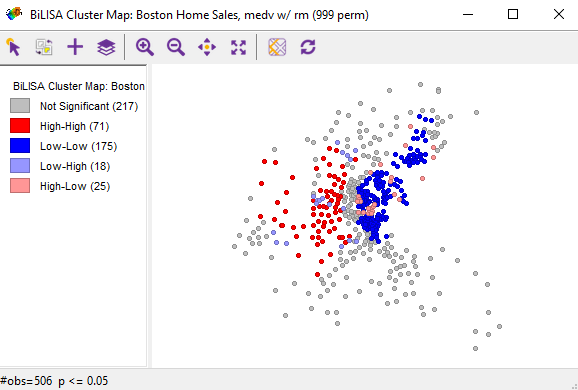

(\#fig:unnamed-chunk-12-1)Cluster map

(\#fig:unnamed-chunk-12-2)Significance map

The cluster map allows us to understand in which areas of the city housing with a big number of rooms can be sold at a higher price.
In the *high-high* and *low-low* areas houses with a small number of rooms are located.
It is not profitable to sell housing with a large number of rooms there.

Interesting to explore the *high-low* areas.
Houses with a small number of rooms are located there.
At the same time, there are houses with a large number of rooms around.
Increasing prices for such apartments will not have a repulsive effect.
It means that we **need to choose a *high-low* areas** to increase housing prices as a realtor.
